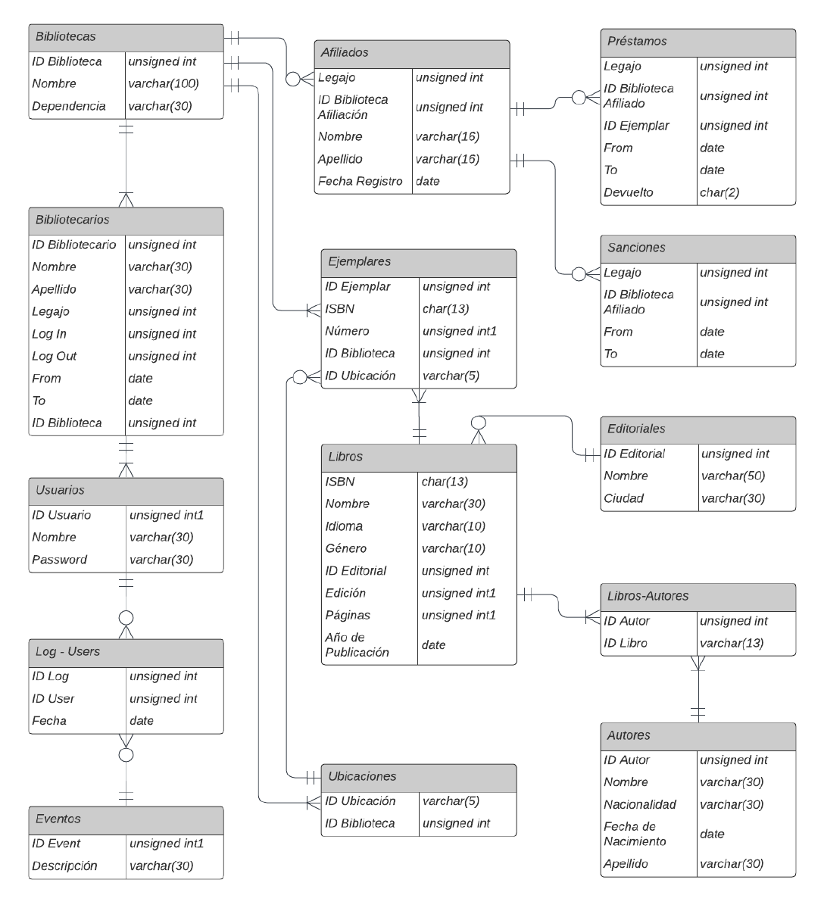

# Library Management System

## Introduction

This is a small library management system developed as a part of the "Database Theory" course. The primary goal of this project was to gain an understanding of data sublanguages like DDL and DML, implement a data model, and explore the data-centric objectives of an organization.

## Technology Used

The system was developed using Java Swing, a graphical user interface (GUI) toolkit for Java. Java Swing provides a set of components for creating user-friendly and interactive applications.

## Project Scope

The project involved the development of a library management system that encompasses various aspects of library operations. This included functionalities related to:

- Book cataloging and management
- Patron registration and management
- Loan and return of books
- Search and retrieval of books

## Normalized Data Model

A normalized data model was implemented to ensure efficient data storage and minimize data redundancy. The use of normalization techniques helps optimize database performance and reduces the risk of anomalies in data manipulation.

## Additional Information

For more information, including non-technical details, you can refer to the documentation provided in the `/docs` directory.
